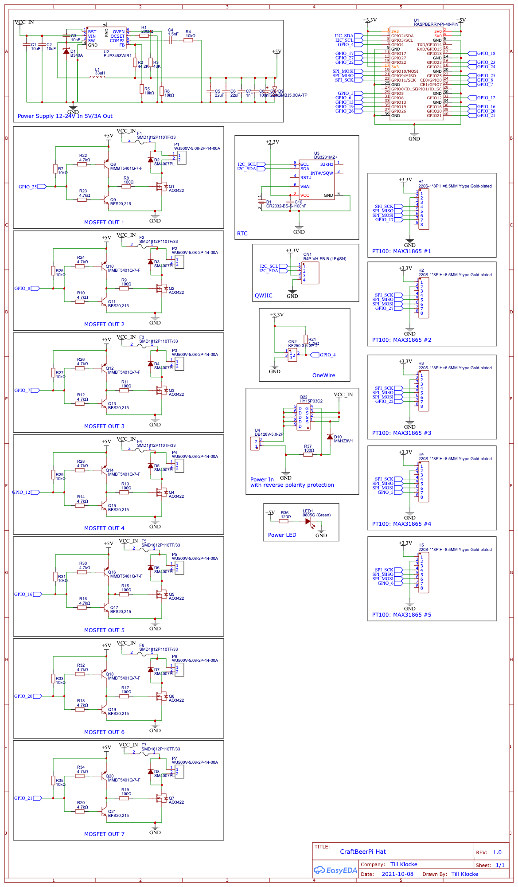

# CraftBeerPi Hat
This is a Raspberry Pi hat meant for use with [CraftBeerPi](https://github.com/craftbeerpi/craftbeerpi4).
It's created with [EasyEDA](https://easyeda.com/) and optimized for production via 
[JLCPCB](https://jlcpcb.com/).

This project is [certified](https://certification.oshwa.org/de000132.html) as open source
hardware by the [OSHWA](https://www.oshwa.org/) under the UID DE000132.


## Development

Currently this project is designed with [EasyEDA](https://easyeda.com/). You can find
all necessary files in the folder `easyeda`. When modifying this project please
respect the CERN-OHL-S license used in this project.

## Features

* Slots for up to 5 MAX31865 modules for PT100/PT1000 measurements
* 7 digital outputs with up to 1 amp of output power
* All 7 outputs have flyback diodes to drive inductive loads like solenoids
* All 7 outputs have resettable fuses for extra protection
* RTC so the Raspberry Pi doesn't loose its time in offline installations
* QWIIC connector to hookup additional sensors and actors following the 
  SparkFun QWIIC specification
* OneWire connection for additional sensors
* Can operate on 12-24V, digital outputs operate directly on input voltage
* Reverse voltage protection (but please be still be careful)

Please note that the digital outputs are inverted in logic due to the push pull stage, but
CraftBeerPi supports inverting GPIO actors.

# Polarity of connectors!!!

This board is powered by 12-24V and provides some reverse polarity protection. But still
please be careful when wiring up the board. Looking at the front of a connector the left
side of a connector is always the negative side and the right side of a connector is always
the positive side!

PCB:


Schematic:



## PIN configuration

### Digital outputs

Digital outputs are counted starting on the most left. Outputs 2,3 and 7 are marked on the edge of
the PCBs upper layer. On the bottom layer every output is numbered and the polarity marked. On the
upper layer polarity markings are only next to the outer most ports on each side. But polarity is
always left side negative, right side positive.

| Output # | GPIO |
|----------|------|
| 1 | 25 |
| 2 |  8 |
| 3 |  7 |
| 4 | 12 |
| 5 | 16 |
| 6 | 20 |
| 7 | 21 |


### MAX31865 modules

The MAX31865 modules are connected via SPI and each have a different CS-Pin. Modules
1,2,3,5 are mounted with the upper side facing left (towards the power connector and the SD-card
slot of the Raspberry Pi). Module 5 is flipped 180°. Every module connector has the first two and
last two pins marked with the same markings as the module to ensure the correct orientation.

| Modules # | GPIO CS |
|-----------|---------|
| 1 | 17 |
| 2 | 27 |
| 3 | 22 |
| 4 |  5 |
| 5 |  6 |

### OneWire

The OneWire data line is connected to `GPIO 4`. The pins on the connector are marked behind the connector
on the top side of the PCB. They are, from left to right `VCC` - `DAT` - `GND`. A 4.7k pull up is
already provided on the board.
To enable OneWire support on a Raspberry Pi you need to add
```
dtoverlay=w1-gpio,gpiopin=4
```
to your config.txt

### RealTime Clock

The RTC (DS3231) is connected via I2C and should be usable by adding
```
dtparam=i2c_arm=on
dtoverlay=i2c-rtc,ds3231
```
to your config.txt

## Known Caveats

### Revision 1.0

* On revision 1.0 outputs 2 and 3 are mapped to chip enable pins of SPI0. Users need to disable CE pins on SPI0
* On revision 1.0 outputs are not in the desired off state during and directly after boot
