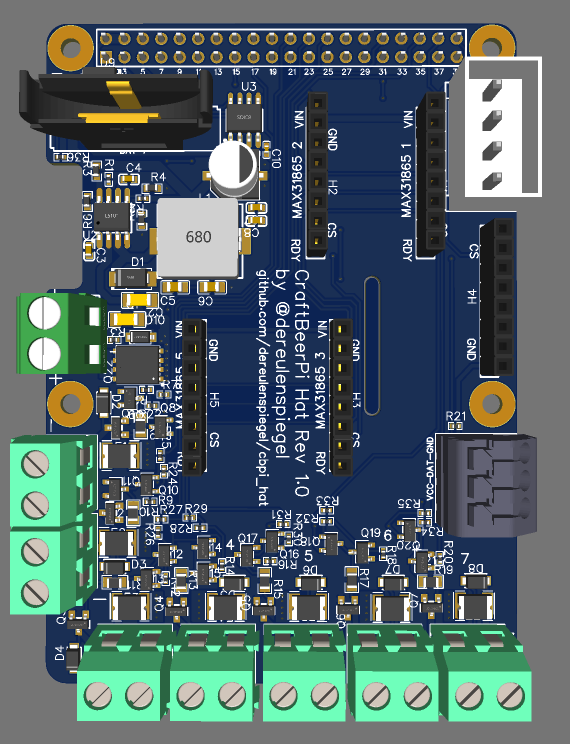

# CraftBeerPi Hat
This is a Raspberry Pi hat meant for use with [CraftBeerPi](https://github.com/craftbeerpi/craftbeerpi4).
This created with [EasyEDA](https://easyeda.com/) and optimized for production via 
[JLCPCB](https://jlcpcb.com/).

## Features

* Slots for up to 5 MAX31864 modules for PT100/PT1000 measurements
* 7 digital outputs with up to 1 amp of output power
* All 7 outputs have flyback diodes to drive inductive loads like solenoids
* All 7 outputs have resettable fuses for extra protection
* RTC so the Raspberry Pi doesn't loose its time in offline installations
* QWIIC connector to hookup additional sensors and actors following the 
  SparkFun QWIIC specification
* One Wire connection for additional sensors
* Can operate on 12-24V, digital outputs operate directly on input voltage

PCB:

Schematic:


## PIN configuration

### Digital outputs

Digital outputs are counted starting on the most left

| Output # | GPIO |
|----------|------|
| 1 | 25 |
| 2 |  8 |
| 3 |  7 |
| 4 | 12 |
| 5 | 16 |
| 6 | 20 |
| 7 | 21 |


### MAX31865 modules

The MAX31864 modules are connected via SPI and each have a different CS-Pin.

| Modules # | GPIO CS |
|-----------|---------|
| 1 | 17 |
| 2 | 27 |
| 3 | 22 |
| 4 |  5 |
| 5 |  6 |

### OneWire

The OneWire data line is connected to `GPIO 4`.

### RealTime Clock

The RTC (DS3231) is connected via I2C and should be usable by adding
```
dtparam=i2c_arm=on
dtoverlay=i2c-rtc,ds3231
```
to your config.txt
