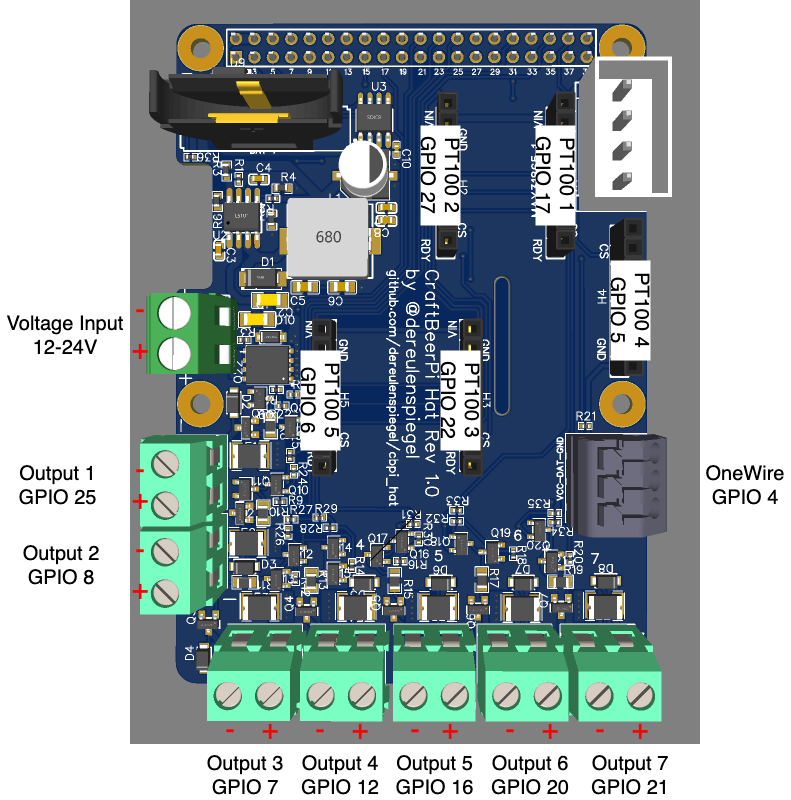

# Hardware Setup

The board itself has been designed with ease of use in mind. However certain things need
to be considered.

## Power

First of all please use a proper power supply to power the board. In theory every output
can provide up to 1 amp and the Rasperry Pi could draw up to 3 amp. So in total the board might
require up to 10 amp to be provided by the PSU. Please calculate your actual power requirements
and provide proper fusing on the power input as currently only the outputs have fuses but not
the overall board itself.

When deciding for the voltage it is best to consider what voltage you need on the outputs as the 
outputs will directly output the input voltage. The hat will convert every input voltage between
12V and 24V into 5V for the Raspberry Pi. There is no need to power the Raspberry Pi through USB.
So please do not power the Raspberry Pi via USB when using the hat, as this might damage the
Raspberry Pi and/or the hat.

## Polarity

Even though the board has reverse voltage protection on its input, polarity is important for
successful operation. When looking at the front of a screw terminal the negative side is always left
and the positive side is always right. This is true for the input connector and all output screw 
terminals. There are also markings `+` and `-` next to connectors if there is space for that on the
top side. On the bottom side the polarity and numbering of all connectors is marked in full.

## MAX31865 for PT100/PT1000

On the board are five slots for MAX31865 modules like the ones from [Adafruit](https://www.adafruit.com/product/3328).
Slots 1,2,3 and 5 are oriented in the same direction with the MAX31865 modules top side facing to the left. Slot 4 is
reversed for space saving reasons and is therefore facing to the right.

In CraftBeerPi you need to configure for each module you have plugged in and want to use the correct chip enable.
The GPIOs used as chip enable for each slot are marked in the overview picture, but here is additionally a handy
table:

| Module # | GPIO CS |
|-----------|---------|
| 1 | 17 |
| 2 | 27 |
| 3 | 22 |
| 4 |  5 |
| 5 |  6 |

## RTC

For the RTC to properly work you need to insert a CR2032 battery into the battery holder. The polarity is marked on the board.

## Outputs

The board has 7 different powered outputs to drive GPIO actors. Every output outputs the input voltage with up to 1 amp to drive
SSRs, relays, solenoids etc. For loads like relays and solenoids the polarity should not matter. For other loads the polarity is the
same as on the input (left negative side, right positive side).

**All outputs are inverted, meaning that they are active when the GPIO is driven low and vice versa!**  
**Ensure that you select "Inverted" "Yes" when configuring the GPIO actor in CraftBeerPi!**
